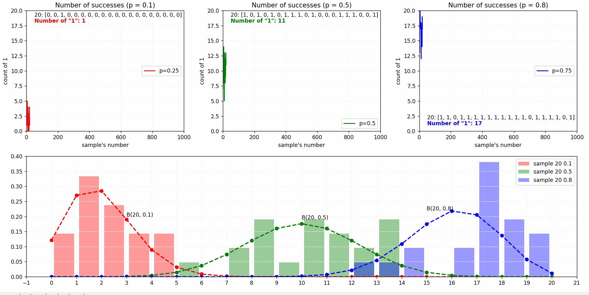
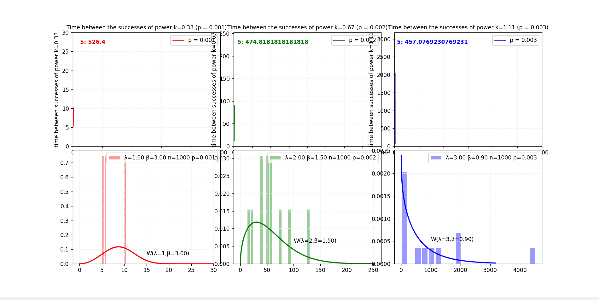
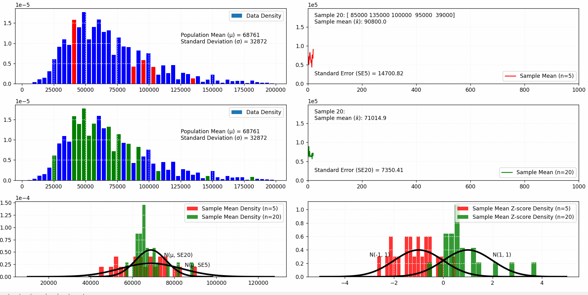
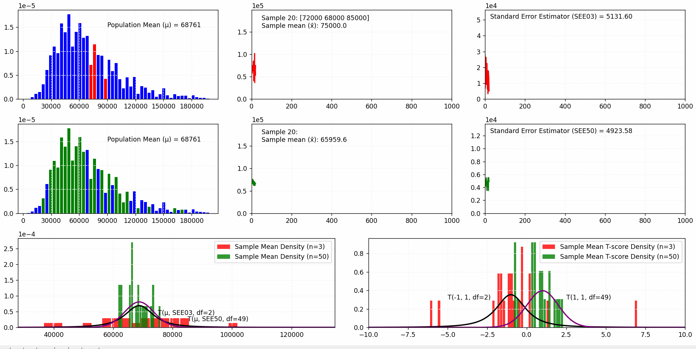

# Probability Distributions

1. [Binomial Distribution](#binomial-distribution)
2. [Poisson Distribution](#poisson-distribution)
3. [Exponential Distribution](#exponential-distribution)
4. [Weibull Distribution](#weibull-distribution)
5. [Gamma Distribution](#gamma-distribution)
6. [Beta Distribution](#beta-distribution)
7. [Hypergeometric Distribution](#hypergeometric-distribution)
8. [Normal Distribution](#normal-distribution)
9. [Student's t-Distribution](#students-t-distribution)
10. [Chi-squared Distribution](#chi-squared-distribution)
11. [F-Distribution](#f-distribution)

## Binomial Distribution

See: [`01-distribution-binomial.py`](./01-distribution-binomial.py)

```
X_RANGE = 1000
Y_RANGE = 20
P_1 = 0.1 # probability of "success" (one) for the first distribution
P_2 = 0.5 # probability of "success" (one) for the second distribution
P_3 = 0.8 # probability of "success" (one) for the third distribution
...
for i in range(X_RANGE): 
    sample1 = [1 if r < P_1 else 0 for r in [random.random() for i in range(Y_RANGE)]]
    sample2 = [1 if r < P_2 else 0 for r in [random.random() for i in range(Y_RANGE)]]
    sample3 = [1 if r < P_3 else 0 for r in [random.random() for i in range(Y_RANGE)]]

    distr1.loc[i] = sample1.count(1)
    distr2.loc[i] = sample2.count(1)
    distr3.loc[i] = sample3.count(1)
    ...
```



## Poisson Distribution

See: [`02-distribution-poisson.py`](./02-distribution-poisson.py)

```
X_RANGE = 1000 # 1000 samples
Y_RANGE = 1000 # take the size of a sample large enough
P1 = 0.001 # probability of "success" (one) for the first distribution (mean for 1000 samples is λ = 1)
P2 = 0.01 # probability of "success" (one) for the first distribution (mean for 1000 samples is λ = 10)
P3 = 0.03 # probability of "success" (one) for the first distribution (mean for 1000 samples is λ = 30)
...
for i in range(X_RANGE): 
    # https://numpy.org/doc/stable/reference/random/generated/numpy.random.poisson.html
    # The Poisson distribution is the limit of the binomial distribution for large N.
    sample_1 = [1 if r < P1 else 0 for r in [random.random() for i in range(Y_RANGE)]]
    sample_2 = [1 if r < P2 else 0 for r in [random.random() for i in range(Y_RANGE)]]
    sample_3 = [1 if r < P3 else 0 for r in [random.random() for i in range(Y_RANGE)]]

    distr_1.loc[i] = sample_1.count(1)
    distr_2.loc[i] = sample_2.count(1)
    distr_3.loc[i] = sample_3.count(1)
    ...
```


## Exponential Distribution

See: [`03-distribution-exponential.py`](./03-distribution-exponential.py)

```
X_RANGE = 1000 # up to 1000 hours
Y_RANGE = 20   # up to 20 events per hour

LAMBDA_1 = 1 # mean of successes, 1 success in average per the given time range
LAMBDA_2 = 2 # mean of successes, 2 successes in average per the given time range
LAMBDA_3 = 3 # mean of successes, 3 successes in average per the given time range

P1 = LAMBDA_1 / Y_RANGE # (ex. 5% out of 20, 0.1% out of 1000)
P2 = LAMBDA_2 / Y_RANGE # (ex. 10% out of 20, 0.2% out of 1000)
P3 = LAMBDA_3 / Y_RANGE # (ex. 15% out of 20, 0.3% out of 1000)

THETA_1 = (Y_RANGE - LAMBDA_1)/LAMBDA_1 # mean of time interval between the successes 
                                        # (ex. 1 successes in 1000 means ~ 999 time interval in average)
THETA_2 = (Y_RANGE - LAMBDA_2)/LAMBDA_2 # mean of time interval between the successes 
                                        # (ex. 2 successes in 1000 means ~ 499 time interval in average)
THETA_3 = (Y_RANGE - LAMBDA_3)/LAMBDA_3 # mean of time interval between the successes 
                                        # (ex. 3 successes in 1000 means ~ 332 time interval in average)
...
# 1 0 0 0 1 0 0 0 0 0 0 0 0 1 0 0 0 0 1
# Number of successes: 4
# Times between successes: [3, 8, 4] 
def calc_times(sample: list, df: pd.DataFrame, remainder: int):
    time = remainder
    for event in sample:
        if event == 1:
            df.loc[len(df), 'time'] = time
            time = 0
        elif event == 0:
            time += 1
    return df, time

remainder1 = 0
remainder2 = 0
remainder3 = 0
for i in range(X_RANGE): 
    # https://numpy.org/doc/stable/reference/random/generated/numpy.random.poisson.html
    # The Poisson distribution is the limit of the binomial distribution for large N.
    sample_1 = [1 if r < P1 else 0 for r in [random.random() for i in range(Y_RANGE)]]
    sample_2 = [1 if r < P2 else 0 for r in [random.random() for i in range(Y_RANGE)]]
    sample_3 = [1 if r < P3 else 0 for r in [random.random() for i in range(Y_RANGE)]]

    distr_1, remainder1 = calc_times(sample_1, distr_1, remainder1)
    distr_2, remainder2 = calc_times(sample_2, distr_2, remainder2)
    distr_3, remainder3 = calc_times(sample_3, distr_3, remainder3)
    ...
```


## Weibull Distribution

See: [`04-distribution-exponential.py`](./04-distribution-weibull.py)

```
X_RANGE = 1000 # up to 1000 hours
Y_RANGE = 1000 # up to 20 events per hour

LAMBDA_1 = 1 # mean of successes, 1 success in average per the given time range
LAMBDA_2 = 2 # mean of successes, 2 successes in average per the given time range
LAMBDA_3 = 3 # mean of successes, 3 successes in average per the given time range

P1 = LAMBDA_1 / Y_RANGE # (ex. 1% out of 100, 0.1% out of 1000)
P2 = LAMBDA_2 / Y_RANGE # (ex. 2% out of 100, 0.2% out of 1000)
P3 = LAMBDA_3 / Y_RANGE # (ex. 3% out of 100, 0.3% out of 1000)

THETA_1 = (Y_RANGE - LAMBDA_1)/LAMBDA_1 # mean of time interval between the successes 
                                        # (ex. 1 successes in 1000 means ~ 999 time interval in average)
THETA_2 = (Y_RANGE - LAMBDA_2)/LAMBDA_2 # mean of time interval between the successes 
                                        # (ex. 2 successes in 1000 means ~ 499 time interval in average)
THETA_3 = (Y_RANGE - LAMBDA_3)/LAMBDA_3 # mean of time interval between the successes 
                                        # (ex. 3 successes in 1000 means ~ 332 time interval in average)

BETA_1 = 3.0
BETA_2 = 1.5 
BETA_3 = 0.9 

K_1 = 1/BETA_1
K_2 = 1/BETA_2
K_3 = 1/BETA_3
...
# 1 0 0 0 1 0 0 0 0 0 0 0 0 1 0 0 0 0 1
# Number of successes: 4
# Times between successes: [3, 8, 4] 
def calc_times(sample: list, df: pd.DataFrame, remainder: int):
    time = remainder
    for event in sample:
        if event == 1:
            df.loc[len(df), 'time'] = time
            time = 0
        elif event == 0:
            time += 1
    return df, time

remainder1 = 0
remainder2 = 0
remainder3 = 0
for i in range(X_RANGE): 
    # https://numpy.org/doc/stable/reference/random/generated/numpy.random.poisson.html
    # The Poisson distribution is the limit of the binomial distribution for large N.
    sample_1 = [1 if r < P1 else 0 for r in [random.random() for i in range(Y_RANGE)]]
    sample_2 = [1 if r < P2 else 0 for r in [random.random() for i in range(Y_RANGE)]]
    sample_3 = [1 if r < P3 else 0 for r in [random.random() for i in range(Y_RANGE)]]

    distr_1, remainder1 = calc_times(sample_1, distr_1, remainder1)
    distr_2, remainder2 = calc_times(sample_2, distr_2, remainder2)
    distr_3, remainder3 = calc_times(sample_3, distr_3, remainder3)

    # https://docs.scipy.org/doc/scipy/reference/generated/scipy.stats.weibull_min.html
    # Suppose X is an exponentially distributed random variable with scale s. 
    # Then Y = X**k is weibull_min distributed with shape c = 1/k and scale s**k.
    distr_1_pow_k = np.power(distr_1.values, K_1)
    distr_2_pow_k = np.power(distr_2.values, K_2)
    distr_3_pow_k = np.power(distr_3.values, K_3)
    ...
```



## Gamma Distribution

See: [`05-distribution-gamma.py`](./05-distribution-gamma.py)

```
X_RANGE = 1000 # up to 1000 hours
Y_RANGE = 20   # up to 20 events an hours

LAMBDA_1 = 1 # mean of successes, 3 successes in average per the given time range
LAMBDA_2 = 2 # mean of successes, 2 successes in average per the given time range
LAMBDA_3 = 3 # mean of successes, 1 successes in average per the given time range

P1 = LAMBDA_1 / Y_RANGE # (ex. 1% out of 100, 0.1% out of 1000)
P2 = LAMBDA_2 / Y_RANGE # (ex. 2% out of 100, 0.2% out of 1000)
P3 = LAMBDA_3 / Y_RANGE # (ex. 3% out of 100, 0.3% out of 1000)

THETA_1 = (Y_RANGE - LAMBDA_1)/LAMBDA_1 # mean of time interval between the successes 
                                        # (ex. 1 successes in 10 means ~ 9 time interval in average)
THETA_2 = (Y_RANGE - LAMBDA_2)/LAMBDA_2 # mean of time interval between the successes 
                                        # (ex. 2 successes in 10 means ~ 4 time interval in average)
THETA_3 = (Y_RANGE - LAMBDA_3)/LAMBDA_3 # mean of time interval between the successes 
                                        # (ex. 3 successes in 10 means ~ 2 time interval in average)

K_1 = 3 # aka α - number of degrees of freedom (number of events to count the time elapsed for)
K_2 = 2 # aka α - number of degrees of freedom (number of events to count the time elapsed for)
K_3 = 1 # aka α - number of degrees of freedom (number of events to count the time elapsed for)
...
# 1 0 0 0 1 0 0 0 0 0 0 0 0 1 0 0 0 0 1
# Number of successes: 4
# Times between successes: [3, 8, 4] 
def calc_times(sample: list, df: pd.DataFrame, remainder: int):
    time = remainder
    for event in sample:
        if event == 1:
            df.loc[len(df), 'time'] = time
            time = 0
        elif event == 0:
            time += 1
    return df, time

remainder1 = 0
remainder2 = 0
remainder3 = 0
for i in range(X_RANGE): 
    # https://numpy.org/doc/stable/reference/random/generated/numpy.random.poisson.html
    # The Poisson distribution is the limit of the binomial distribution for large N.
    sample_1 = [1 if r < P1 else 0 for r in [random.random() for i in range(Y_RANGE)]]
    sample_2 = [1 if r < P2 else 0 for r in [random.random() for i in range(Y_RANGE)]]
    sample_3 = [1 if r < P3 else 0 for r in [random.random() for i in range(Y_RANGE)]]

    distr_1, remainder1 = calc_times(sample_1, distr_1, remainder1)
    distr_2, remainder2 = calc_times(sample_2, distr_2, remainder2)
    distr_3, remainder3 = calc_times(sample_3, distr_3, remainder3)

    distr_1_k = [np.sum(distr_1.values[K_1*i: K_1*i+K_1]) for i in range(int(len(distr_1)/K_1))]
    distr_2_k = [np.sum(distr_2.values[K_2*i: K_2*i+K_2]) for i in range(int(len(distr_2)/K_2))]
    distr_3_k = [np.sum(distr_3.values[K_3*i: K_3*i+K_3]) for i in range(int(len(distr_3)/K_3))]
    ...
```


## Beta Distribution

See: [`06-distribution-gamma.py`](./06-distribution-gamma.py)

```
X_RANGE = 1000

K_1 = 1 # 1st Pair
K_2 = 9 # 1st Pair
K_3 = 2 # 2nd Pair
K_4 = 4 # 2nd Pair
K_5 = 0.5 # 3rd Pair
K_6 = 0.5 # 3rd Pair
...
# Generate gamma distributed random arrays:
# 0: [0 .. 999]
# 1: [0 .. 999]
# ..
# 7: [0 .. 999]
gamma = []
gamma.append(stats.gamma.rvs(a=K_1, size=X_RANGE))
gamma.append(stats.gamma.rvs(a=K_2, size=X_RANGE))
gamma.append(stats.gamma.rvs(a=K_3, size=X_RANGE))
gamma.append(stats.gamma.rvs(a=K_4, size=X_RANGE))
gamma.append(stats.gamma.rvs(a=K_5, size=X_RANGE))
gamma.append(stats.gamma.rvs(a=K_6, size=X_RANGE))
# TRANSPOSE for each iteration of for-loop below:
# 0: [0 .. 7]
# 1: [0 .. 7]
# ..
# 999: [0 .. 7]
gamma = np.array(gamma).transpose().tolist()

for i in range(X_RANGE):
    ########### 
    x00 = [gamma[i][0], gamma[i][1]]
    beta_0 = (x00[0]) / (x00[0] + x00[1])
    ...
    ########### 
    x01 = [gamma[i][2], gamma[i][3]]
    beta_1 = (x01[0]) / (x01[0] + x01[1])
    ...
    ########### 
    x02 = [gamma[i][4], gamma[i][5]]
    beta_2 = (x02[0]) / (x02[0] + x02[1])
    ...
    ###########
    betas_0.append(beta_0)
    betas_1.append(beta_1)
    betas_2.append(beta_2)
    ...
```


## Hypergeometric Distribution

See: [`07-distribution-hypergeometric.py`](./07-distribution-hypergeometric.py)

```
cards = pd.DataFrame([
    ['C', '2'], ['D', '2'], ['H', '2'], ['S', '2'],
    ['C', '3'], ['D', '3'], ['H', '3'], ['S', '3'],
    ['C', '4'], ['D', '4'], ['H', '4'], ['S', '4'],
    ['C', '5'], ['D', '5'], ['H', '5'], ['S', '5'],
    ['C', '6'], ['D', '6'], ['H', '6'], ['S', '6'],
    ['C', '7'], ['D', '7'], ['H', '7'], ['S', '7'],
    ['C', '8'], ['D', '8'], ['H', '8'], ['S', '8'],
    ['C', '9'], ['D', '9'], ['H', '9'], ['S', '9'],
    ['C', '10'], ['D', '10'], ['H', '10'], ['S', '10'],
    ['C', 'J'], ['D', 'J'], ['H', 'J'], ['S', 'J'],
    ['C', 'Q'], ['D', 'Q'], ['H', 'Q'], ['S', 'Q'],
    ['C', 'K'], ['D', 'K'], ['H', 'K'], ['S', 'K'],
    ['C', 'A'], ['D', 'A'], ['H', 'A'], ['S', 'A'],
], columns=['Suit', 'Rank'])

CARDS_1 = 5 
CARDS_2 = 15 
CARDS_3 = 25 

N = len(cards) 
S_COUNT = cards['Suit'].values.tolist().count('S') 
H_COUNT = cards['Suit'].values.tolist().count('H') 
X_RANGE = 1000 
...
for i in range(X_RANGE):
    sample_1 = cards.sample(CARDS_1)
    sample_2 = cards.sample(CARDS_2)
    sample_3 = cards.sample(CARDS_3)

    distr_1.loc[i] = sample_1['Suit'].values.tolist().count('S')
    distr_1.loc[i] += sample_1['Suit'].values.tolist().count('H')
    distr_2.loc[i] = sample_2['Suit'].values.tolist().count('S')
    distr_2.loc[i] += sample_2['Suit'].values.tolist().count('H')
    distr_3.loc[i] = sample_3['Suit'].values.tolist().count('S')
    distr_3.loc[i] += sample_3['Suit'].values.tolist().count('H')
    ...
```


## Normal Distribution

See: [`08-distribution-normal.py`](./08-distribution-normal.py)

```
mean = raw_data.mean() # μ - mean of the population
std = raw_data.std()   # σ - standard deviation of the populatio

se_05 = std / math.sqrt(5)  # Standard Error (SE05) for the sample of size 5
se_20 = std / math.sqrt(20) # Стандартная ошибка (SE20) for the sample of size 20
...
for i in range(1000): 
    sample_05 = raw_data.sample(5)
    sample_20 = raw_data.sample(20)
    ...
    sample_mean_05.loc[i] = [sample_05.mean()] # x̄ - mean of the sample n=5
    sample_mean_20.loc[i] = [sample_20.mean()] # x̄ - mean of the sample n=20
    ...
    z_sample_mean_05 = (sample_mean_05['mean_05'] - mean) / se_05 - 1 # -1, to shift away two charts from each other
    z_sample_mean_20 = (sample_mean_20['mean_20'] - mean) / se_20 + 1 # +1, to shift away two charts from each other
    ...
```



## Student's t-Distribution

See: [`09-distribution-t.py`](./09-distribution-t.py)

```
mean = raw_data.mean() # μ - mean of the population
...
SAMPLE_SIZE_1 = 3  # the size of samples in the first group 
SAMPLE_SIZE_2 = 50 # the size of samples in the second group
...
for i in range(1000): 
    sample_1 = raw_data.sample(SAMPLE_SIZE_1)
    sample_2 = raw_data.sample(SAMPLE_SIZE_2)

    # https://en.wikipedia.org/wiki/Standard_error#Estimate
    see_1 = sample_1.std() / math.sqrt(SAMPLE_SIZE_1) # use the standard deviation of a sample (s) instead of standard deviation of a population (σ)
    see_2 = sample_2.std() / math.sqrt(SAMPLE_SIZE_2) # use the standard deviation of a sample (s) instead of standard deviation of a population (σ)
    ...
    sample_mean_1.loc[i] = [sample_1.mean()]
    sample_mean_2.loc[i] = [sample_2.mean()]
    ...
    sample_see_1.loc[i] = [see_1] # Standard Error Estimator n=3
    sample_see_2.loc[i] = [see_2] # Standard Error Estimator n=50
    ...
    # https://en.wikipedia.org/wiki/Student%27s_t-test#One-sample_t-test
    t_sample_mean_1.loc[i] = ((sample_1.mean() - mean) / see_1) - 1 # -1, to shift away two charts from each other
    t_sample_mean_2.loc[i] = ((sample_2.mean() - mean) / see_2) + 1 # +1, to shift away two charts from each other
```



## Chi-squared Distribution

See: [`10-distribution-chi-squared.py`](./10-distribution-chi-squared.py)

```
X_RANGE = 1000

DF_1 = 2
DF_2 = 3
DF_3 = 8
...
# Generate normally distributed random arrays:
# 0: [0 .. 999]
# 1: [0 .. 999]
# ..
# 7: [0 .. 999]
normal = [stats.norm.rvs(size=X_RANGE) for i in range(max(DF_1, DF_2, DF_3))]
# TRANSPOSE for each iteration of for-loop below:
# 0: [0 .. 7]
# 1: [0 .. 7]
# ..
# 999: [0 .. 7]
normal = np.array(normal).transpose().tolist()
for i in range(X_RANGE):
    ########### Degrees of Freedom 1
    x00 = normal[i][0: DF_1] # Array of Random Values [Z1, Z2]
    chi_squared_0 = np.sum(np.square(x00)) # Take a square and sum
    ...
    ########### Degrees of Freedom 2
    x01 = normal[i][0: DF_2] # Array of Random Values [Z1, Z2, Z3]
    chi_squared_1 = np.sum(np.square(x01)) # Take a square and sum
    ...
    ########### Degrees of Freedom 3
    x02 = normal[i][0: DF_3] # Array of Random Values [Z1, Z2, Z3, Z4, Z5, Z6, Z7, Z8]
    chi_squared_2 = np.sum(np.square(x02)) # Take a square and sum
    ...
    ###########
    chis_0.append(chi_squared_0)
    chis_1.append(chi_squared_1)
    chis_2.append(chi_squared_2)
    ...
```


## F-Distribution

See: [`11-distribution-f.py`](./11-distribution-f.py)

```
X_RANGE = 1000

DF_1 = 1 # 1st Pair
DF_2 = 9 # 1st Pair
DF_3 = 2 # 2nd Pair
DF_4 = 4 # 2nd Pair
DF_5 = 3 # 3rd Pair
DF_6 = 5 # 3rd Pair
...
# Generate chi-squared distributed random arrays:
# 0: [0 .. 999]
# 1: [0 .. 999]
# ..
# 7: [0 .. 999]
chi2 = []
chi2.append(stats.chi2.rvs(df=DF_1, size=X_RANGE))
chi2.append(stats.chi2.rvs(df=DF_2, size=X_RANGE))
chi2.append(stats.chi2.rvs(df=DF_3, size=X_RANGE))
chi2.append(stats.chi2.rvs(df=DF_4, size=X_RANGE))
chi2.append(stats.chi2.rvs(df=DF_5, size=X_RANGE))
chi2.append(stats.chi2.rvs(df=DF_6, size=X_RANGE))
# TRANSPOSE for each iteration of for-loop below:
# 0: [0 .. 7]
# 1: [0 .. 7]
# ..
# 999: [0 .. 7]
chi2 = np.array(chi2).transpose().tolist()

for i in range(X_RANGE):
    ########### 
    x00 = [chi2[i][0], chi2[i][1]]
    f_0 = (x00[0] / DF_1) / (x00[1] / DF_2)
    ...
    ########### 
    x01 = [chi2[i][2], chi2[i][3]]
    f_1 = (x01[0] / DF_3) / (x01[1] / DF_4)
    ...
    ########### 
    x02 = [chi2[i][4], chi2[i][5]]
    f_2 = (x02[0] / DF_5) / (x02[1] / DF_6)
    ...
    ###########
    fs_0.append(f_0)
    fs_1.append(f_1)
    fs_2.append(f_2)
    ...
```


# License

This project is available under the [MIT license](LICENSE) © Nail Sharipov