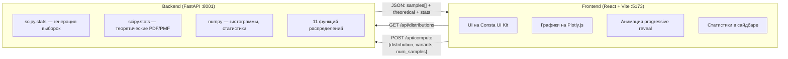
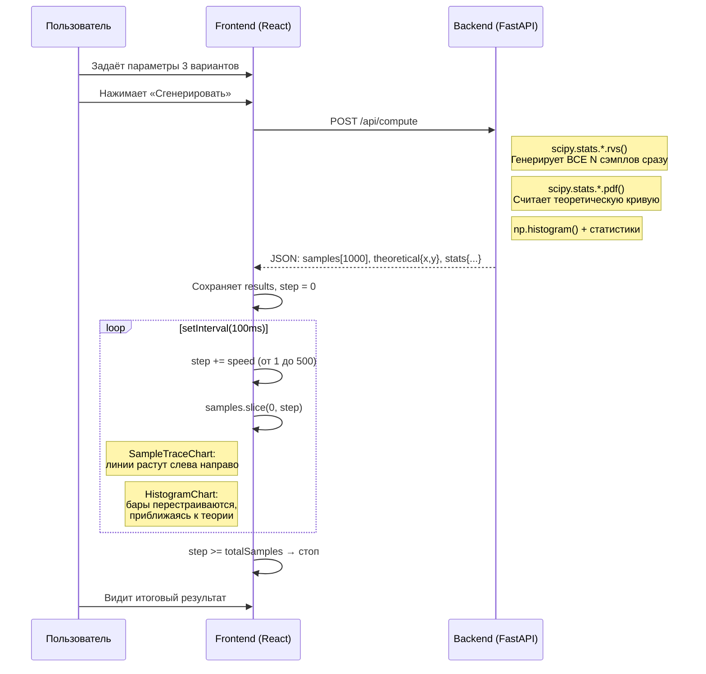
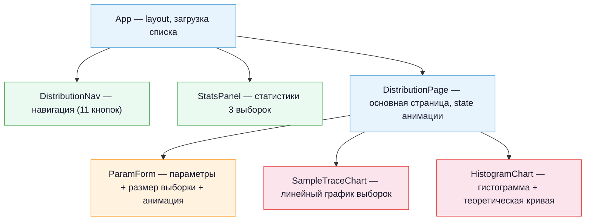
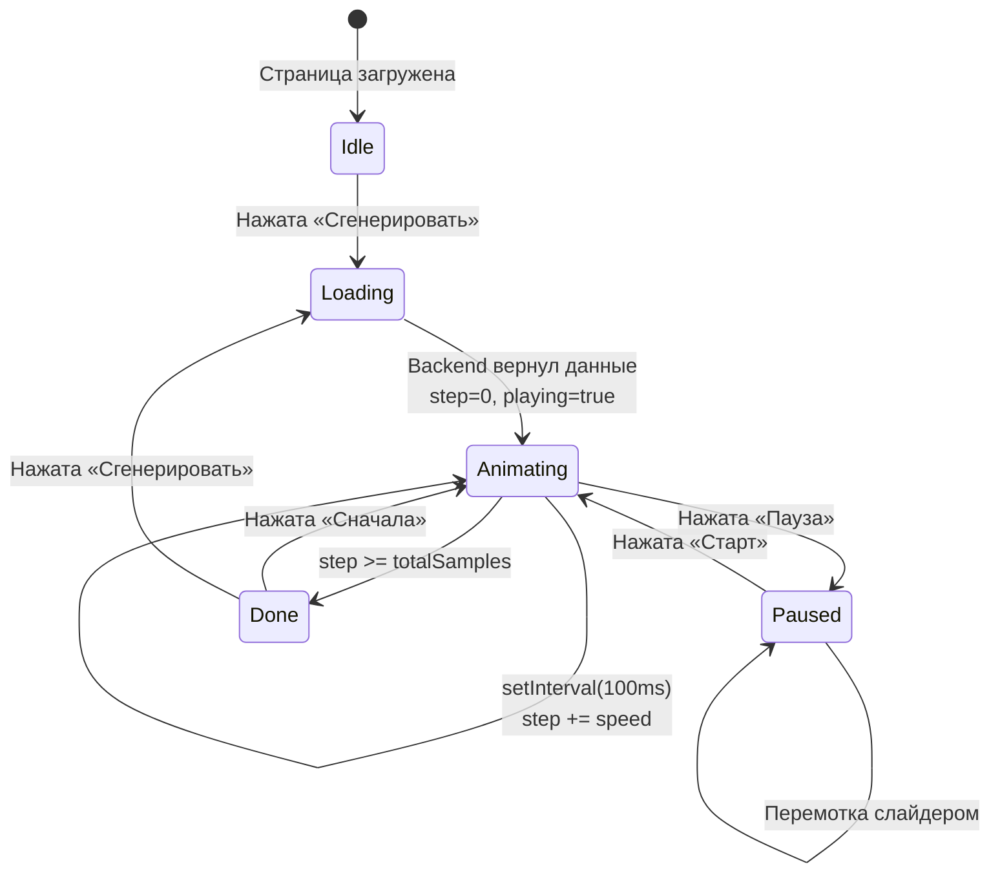

# Stat Distributions — Архитектура

Как устроено взаимодействие Frontend и Backend, и как работает анимация.

## 1. Взаимодействие Frontend и Backend



## 2. Как работает анимация



## 3. Формат данных (API)

### POST /api/compute — Request

```json
{
  "distribution": "binomial",
  "variants": [
    { "n": 20, "p": 0.1 },
    { "n": 20, "p": 0.5 },
    { "n": 20, "p": 0.8 }
  ],
  "num_samples": 1000,
  "num_bins": 30
}
```

### POST /api/compute — Response (per variant)

```json
{
  "label": "Выборка 1",
  "color": "#e53935",
  "samples": [2, 1, 3, 0, ...],           // N случайных значений
  "histogram": {
    "bin_edges": [-0.5, 0.5, 1.5, ...],   // границы бинов
    "counts": [0.12, 0.28, ...]            // density-normalized
  },
  "theoretical": {
    "x": [0, 1, 2, ..., 20],              // точки теоретической кривой
    "y": [0.12, 0.27, ...]                // PMF или PDF
  },
  "stats": {
    "mean": 2.01,
    "variance": 1.82,
    "std": 1.35,
    "median": 2.0,
    "min": 0.0,
    "max": 7.0
  }
}
```

## 4. Дерево компонентов React



## 5. Потоки данных в анимации


